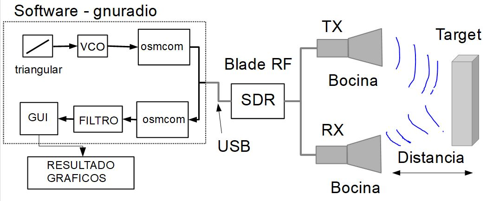
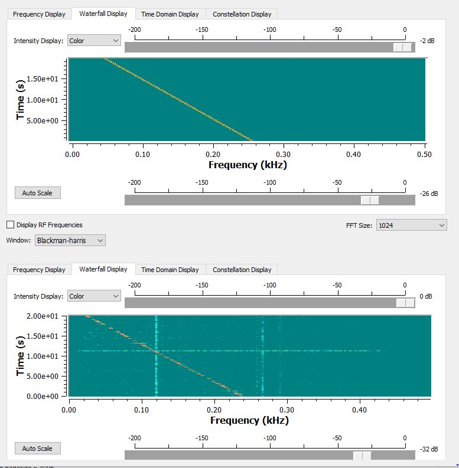

### Diagrama en bloques de un tx y rx de una chirp

### Simulador de un radar fmcw realizado con gnuradio

El diagrama en bloques que simula un radar fmcw es el siguiente

### Chirp transmitida y recibida 
El espectrograma obtenido de la señal chirp transmitida y recibida

